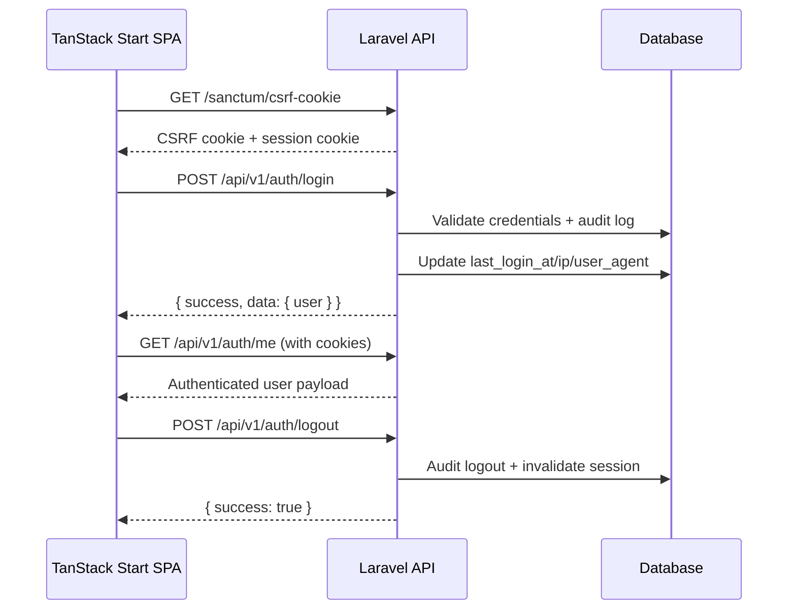

# Phase 1B — Enterprise Authentication & Security

## Overview

Phase 1B delivers a complete Sanctum SPA authentication foundation with enterprise security controls, audit logging preparation, multi-guard architecture, admin web entry point, and comprehensive automated tests.

The TanStack Start frontend was **not modified**. All auth endpoints live under `/api/v1/auth/*` using the Phase 1A standardized JSON envelope.

---

## Authentication flow

### SPA session flow (primary)



### Password reset flow

1. `POST /api/v1/auth/forgot-password` — sends reset link via mail
2. User receives email with signed reset URL (frontend handles link)
3. `POST /api/v1/auth/reset-password` — validates token, updates password, invalidates all sessions/tokens

### Email verification flow

1. Unverified user calls `POST /api/v1/auth/email/verification-notification`
2. Email contains signed link to `GET /api/v1/auth/email/verify/{id}/{hash}`
3. Successful verification sets `email_verified_at`

---

## Sanctum configuration

| Setting          | Value                         | Notes                           |
| ---------------- | ----------------------------- | ------------------------------- |
| Driver           | Session (SPA) + token support | `HasApiTokens` on User model    |
| Stateful domains | `SANCTUM_STATEFUL_DOMAINS`    | Must include frontend origin    |
| Guard            | `web`                         | Checked before bearer token     |
| Middleware       | `statefulApi()` enabled       | CSRF + cookie encryption        |
| Tokens table     | `personal_access_tokens`      | Ready for future API token auth |

### Required `.env` values

```env
SANCTUM_STATEFUL_DOMAINS=localhost,localhost:8080,127.0.0.1,127.0.0.1:8000
SESSION_DRIVER=database
FRONTEND_URL=http://localhost:8080
```

### Frontend integration (future)

1. Call `GET /sanctum/csrf-cookie` before login
2. Include `credentials: 'include'` on all `fetch` calls to `/api/*`
3. Read `X-XSRF-TOKEN` from cookie for CSRF header

---

## Security decisions

| Control                   | Implementation                                                            |
| ------------------------- | ------------------------------------------------------------------------- |
| Password hashing          | Laravel `hashed` cast (bcrypt)                                            |
| Strong passwords          | `StrongPassword` rule — 12+ chars, mixed case, numbers, symbols           |
| Login throttling          | `throttle:auth-login` — 5 attempts/min per email+IP                       |
| Password reset throttling | `throttle:auth-password` — 5 attempts/min                                 |
| Verification resend       | `throttle:6,1`                                                            |
| CSRF                      | Sanctum `statefulApi()` + `ValidateCsrfToken`                             |
| Security headers          | `SecurityHeaders` middleware (X-Frame-Options, nosniff, HSTS on HTTPS)    |
| Session invalidation      | On password change/reset — other sessions + tokens revoked                |
| Account status            | `UserStatus` enum — suspended/inactive users cannot login                 |
| API errors                | Centralized via `ApiExceptionHandler` (401/403/422/429)                   |
| Admin access              | Role check (`super_administrator` or `administrator`) on web admin routes |

---

## Multi-guard architecture

`config/auth.php` defines guards for current and future use:

| Guard           | Status     | Purpose               |
| --------------- | ---------- | --------------------- |
| `web`           | **Active** | SPA/API session auth  |
| `admin`         | **Active** | Admin web portal      |
| `super_admin`   | Reserved   | Phase 2+ RBAC         |
| `administrator` | Reserved   | Phase 2+ RBAC         |
| `leader`        | Reserved   | Leadership portal     |
| `instructor`    | Reserved   | LMS instructor portal |
| `member`        | Reserved   | Member portal         |

All guards currently use the `users` provider. Role slugs are stored in `roles` / `role_user` tables as placeholders — full RBAC is Phase 2+.

---

## API endpoints

Base path: `/api/v1/auth`

| Method | Path                               | Auth       | Description                                |
| ------ | ---------------------------------- | ---------- | ------------------------------------------ |
| POST   | `/login`                           | Public     | Login with email/password, remember me     |
| POST   | `/logout`                          | Sanctum    | Logout + session invalidation              |
| GET    | `/me`                              | Sanctum    | Authenticated user profile                 |
| POST   | `/forgot-password`                 | Public     | Send password reset link                   |
| POST   | `/reset-password`                  | Public     | Reset password with token                  |
| GET    | `/email/verify/{id}/{hash}`        | Signed URL | Verify email address                       |
| POST   | `/email/verification-notification` | Sanctum    | Resend verification email                  |
| POST   | `/change-password`                 | Sanctum    | Change password, invalidate other sessions |
| PUT    | `/profile`                         | Sanctum    | Update profile fields                      |
| POST   | `/avatar`                          | Sanctum    | Upload avatar (max 2MB, jpg/png/webp)      |
| DELETE | `/avatar`                          | Sanctum    | Remove avatar                              |

---

## Database changes

### Extended `users` table

| Column                  | Type             | Notes                                        |
| ----------------------- | ---------------- | -------------------------------------------- |
| `uuid`                  | UUID, unique     | Public identifier                            |
| `first_name`            | string           |                                              |
| `last_name`             | string           |                                              |
| `display_name`          | string           |                                              |
| `phone`                 | string, nullable |                                              |
| `avatar`                | string, nullable | Storage path                                 |
| `status`                | string           | `active`, `inactive`, `suspended`, `pending` |
| `last_login_at`         | timestamp        |                                              |
| `last_login_ip`         | string           |                                              |
| `last_login_user_agent` | text             |                                              |
| `timezone`              | string           | Default `UTC`                                |
| `locale`                | string           | Default `en`                                 |
| `deleted_at`            | timestamp        | Soft deletes                                 |
| `name`                  | string           | Kept for Laravel compatibility (auto-synced) |

### New tables

| Table                       | Purpose                            |
| --------------------------- | ---------------------------------- |
| `personal_access_tokens`    | Sanctum API tokens                 |
| `authentication_audit_logs` | Auth event audit trail             |
| `roles`                     | Placeholder role definitions       |
| `role_user`                 | User-role pivot (placeholder RBAC) |
| `application_settings`      | Placeholder app configuration      |

### Audit events recorded

- `login_succeeded`
- `login_failed`
- `logout`
- `password_reset_requested`
- `password_reset_completed`
- `password_changed`

Each log stores: user_id, email, IP, user agent, timestamp, optional metadata.

---

## Seeders

```bash
php artisan db:seed
```

| Seeder                     | Contents                                                       |
| -------------------------- | -------------------------------------------------------------- |
| `RoleSeeder`               | super_administrator, administrator, leader, instructor, member |
| `ApplicationSettingSeeder` | Display name, email verification flag, throttle settings       |
| `SuperAdminSeeder`         | `admin@marketplaceministers.org` / `password`                  |

---

## Testing performed

```bash
php artisan test
```

| Test suite                  | Coverage                                                        |
| --------------------------- | --------------------------------------------------------------- |
| `AuthLoginTest`             | Valid login, invalid credentials, suspended user, rate limiting |
| `AuthSessionTest`           | `/me`, unauthenticated 401, logout                              |
| `AuthPasswordTest`          | Forgot password, reset, change password, validation format      |
| `AuthEmailVerificationTest` | Signed verify URL, resend notification                          |
| `AdminLoginTest`            | Super admin dashboard access, guest redirect                    |
| `HealthEndpointTest`        | Phase 1A regression                                             |

**Result:** 19 tests, 65 assertions — all passing.

---

## Files created (summary)

### Core auth

- `app/Services/Auth/` — AuthService, PasswordService, ProfileService, AvatarService, AuthAuditService
- `app/Http/Controllers/Api/V1/Auth/` — 11 invokable controllers
- `app/Http/Requests/Auth/` — 6 form requests
- `app/Http/Resources/UserResource.php`
- `app/Notifications/VerifyEmail.php`
- `app/Rules/StrongPassword.php`
- `app/Enums/` — UserStatus, AuthGuardName, AuthAuditEventType

### Database

- 5 migrations + 3 seeders

### Tests

- `tests/Feature/Api/Auth*.php` (4 files)
- `tests/Feature/Admin/AdminLoginTest.php`

---

## Phase boundaries

| Included (1B)             | Deferred                     |
| ------------------------- | ---------------------------- |
| Full Sanctum SPA auth     | RBAC permissions enforcement |
| Audit log recording       | Audit log UI / reporting     |
| Admin login + landing     | Admin dashboard (Phase 1D)   |
| Role/setting placeholders | Role-based route policies    |
| Avatar upload             | Frontend profile UI          |

---

## Verification commands

```bash
cd backend
php artisan migrate:fresh --seed
php artisan test
php artisan serve

# API login
curl -X POST http://127.0.0.1:8000/api/v1/auth/login \
  -H "Content-Type: application/json" \
  -d '{"email":"admin@marketplaceministers.org","password":"password"}'

```
